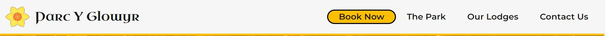
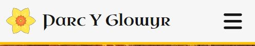
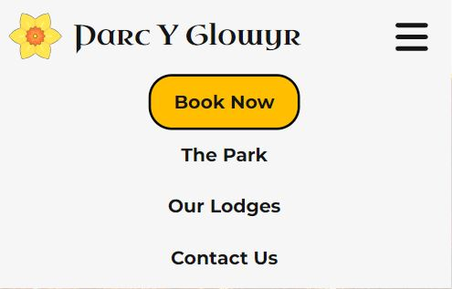

# Parc Y Glowyr (MS1)

## Table of Content

- [Project Goals](#project-goals)
- [User Experience](#user-experience)
    - [Target Audience](#target-audience)
    - [User stories](#user-stories)
    - [Wireframes](#wireframes)
- [Design](#design)
    - [Colour](#colour)
    - [Fonts](#fonts)
    - [Structure](#structure)
    - [Wireframes](#wireframes)
- [Technologies Used](#technologies-used)
    - [Languages](#languages)
    - [Frameworks, Libraries & Tools](#frameworks-libraries--tools)
- [Features](#features)
- [Validation](#validation)
    - [HTML Validation](#html-validation)
    - [CSS Validation](#css-validation)
- [Testing](#testing)
    - [Accessibility](#accessibility)
    - [Performance](#performance)
    - [Performing tests on various devices](#performing-tests-on-various-devices)
    - [Browser compatability](#browser-compatability)
    - [Testing user stories](#testing-user-stories)
- [Bugs](#bugs)
- [Deployment](#deployment)
- [Credits](#credits)
- [Acknowledgements](#acknowledgements)

## Project Goals
Parc Y Glowyr is an adults only holiday park providing luxury lodge accommodations in the heart of the South Wales Valleys.

Parc Y Glowyr has the following business goals;
- Increase bookings of lodge accommodations.
- Increase brand awareness as a luxury provider of lodge accommodations.
- Clearly demonstrate the unique selling point of the park; Luxury accommodations surrounded by nature.
- Construct an intuitive User Experience, to ensure users can easily and effectively gain information on the park and make bookings.

Users of Parc Y Glowyr have the following goals;
- To find a luxury holiday park in South Wales, UK.
- To find information on the park's lodges.
- To find information about the park.
- To arrange lodge bookings.

## User Experience

### Target Audience
- Couples seeking luxury holiday breaks.
- Adult groups seeking luxury holiday breaks.
- Individuals seeking luxury holiday accommodation close to nature.
- Individuals seeking luxury holiday accommodation in South Wales.  

### User Stories
User stories have been seperated into two groups; New users and returning users. 

#### New Users

1. As a new user, I want to know the location of the resort so I know if it in an area where I would like to visit and to plan my journey.
2. As a new user, I want to know what lodges are available at the resort to ensure I get one that will accommodate my party size.
4. As a new user, I want to see pricing information for the lodges.
5. As a new user, I want to see information on the park's office opening times.
6. As a new user, I want to see information on how to book a lodge stay.

#### Returning Users
1. As a returning user, I want to see information on the park's location to support with planning my journey to the park after making a booking.
2. As a returning user, I want to see contact information for the park so I know where I can direct any queries or issues.
3. As a returning user, I want to see information on the check-in times.
4. As a returning user, I want to see information on the check-out times.

#### Site Owner
1. As the site owner, I want users to see information of how to book a lodge stay.
2. As the site owner, I want users to see information of the park's location.
3. As the site owner, I want users to have information on how to contact us.
4. As the site owner, I want the website to be responsive so user's can browse on desktop and mobile devices.
5. As the site owner, I want users to be able to navigate back to the website's home page if they encounter a page which does not exist.

## Design

### Colour
The site's colour scheme consists of five key colours; White, off-white, mid-grey, off-black and light-orange. Off-white and off-black where used in each section to ensure there was adequate contrast, with UI components in the accent-colour of light-orange. Mid-grey was used for the english lodge names. White and off-white were alternated between for ajacent sections, to clearly define the sections.

### Fonts

Two fonts were used on the site; Montserrat for the main site font, which is a clear and legible font. With Uncial Antiqua bringing a celtic and regal feel to the website, while maintaining readability.

### Structure

The website structure consists of five clearly defined sections; Landing, The Park, Our Lodges, Booking and Contact Us. A responsive navigation bar containing the site logo, site name and links to page sections is situated at the top of the page. On smaller screen sizes, the navigation bar links are situated within a dropdown menu which is accessed via a hamburger icon.

The five sections are detailed below;

- A landing section contains the navigation bar and a large image with overlay text. 
- A park section contains a welcome title, a paragraph with information on the park and five circular icons with text showing key features of the park.
- A lodge section contains detailed information on the available lodges, with each lodge container holding an image carousel, icons for beds and parking spaces, text on what is included with he lodege and a link to the page's booking form.
- A booking section contains a booking form.
- A contact section contains details on the park's location, contact details, operating times, check-in/check-out times, social media links and a map of the park's location(As the park is fictional, this shows the area where the park would exist).

The footer of the site contains a disclaimer informing the user that the site is fictional and a copyright notice.

A 404 page was created to ensure that a user can easily navigate back to the park's site if they encounter a page which does not exist.

At the bottom of the page there is a footer with links to social media and copyrights info.

A separate 404 error page was created.

### Languages

- HTML
- CSS
- Javascript (This was only used for the Third-party code imported for the navigation bar)

### Frameworks, Libraries & Tools

- [Am I Responsive](http://ami.responsivedesign.is/), used to create a devices mock-up image. 
- [Balsamiq](https://balsamiq.com/), used to create wireframes.
- [Bootstrap v5.1.3](https://getbootstrap.com/), used for the site's image carousels.
- [Favicon.io](https://favicon.io), used to create the site favicon.
- [Font Awesome](https://fontawesome.com/), used for all site icons.
- [Git](https://git-scm.com/), used for version control within VSCode to push the code to GitHub.
- [GitHub](https://github.com/), used to store project code.
- [Google Fonts](https://fonts.google.com/), used to acquire the site's fonts.
- [Google Maps](https://www.google.com/maps), used to create the contact us section map.
- [Pixabay.com](Pixabay.com), used to acquire the site's images.
- [WC3 Validator](https://validator.w3.org/), [Jigsaw W3 Validator](https://jigsaw.w3.org/css-validator/), [Wave Validator](https://wave.webaim.org/), [Lighthouse](https://developers.google.com/web/tools/lighthouse/) and [Am I Responsive](http://ami.responsivedesign.is/), used to test the site's code, performance, accessibilty and responsiveness. 

## Features

The website consists of five sections with eight features.

### Navigation Bar
- Situated on the Main site page and 404 page.
- Contains the site logo, name and navigation links.
- Logo and site name, when clicked return the user to the landing section.
- Navigation links, when clicked take the user to the relevant sections.
- Navigation bar condenses to a hamburger icon and dropdown menu on smaller screens.

