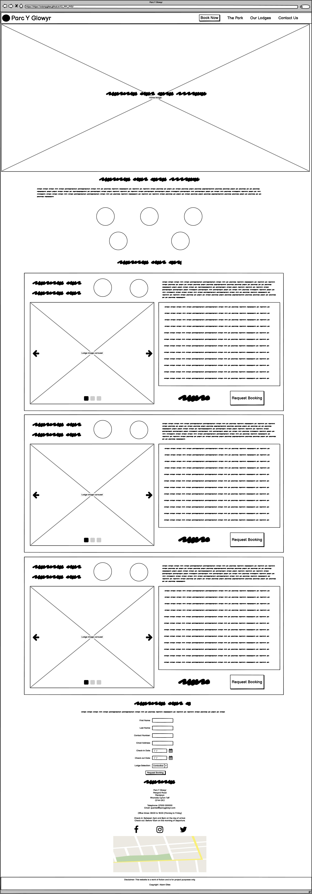

# Parc Y Glowyr 

**Developer: Adam Giles**

[Live website](https://adampgiles.github.io/CI_PP1_PYG/)

## Table of Content

- [Project Goals](#project-goals)
- [User Experience](#user-experience)
    - [Target Audience](#target-audience)
    - [User stories](#user-stories)
    - [Wireframes](#wireframes)
- [Design](#design)
    - [Colour](#colour)
    - [Fonts](#fonts)
    - [Structure](#structure)
    - [Wireframes](#wireframes)
- [Technologies Used](#technologies-used)
    - [Languages](#languages)
    - [Frameworks, Libraries & Tools](#frameworks-libraries--tools)
- [Features](#features)
- [Validation](#validation)
    - [HTML Validation](#html-validation)
    - [CSS Validation](#css-validation)
- [Testing](#testing)
    - [Accessibility](#accessibility)
    - [Performance](#performance)
    - [Device Testing](#device-testing)
    - [Browser Compatibility](#browser-compatibility)
    - [User Story Testing](#user-story-testing)
- [Bugs](#bugs)
- [Deployment](#deployment)
- [Credits](#credits)
- [Acknowledgements](#acknowledgements)

## Project Goals
Parc Y Glowyr is an adults only holiday park providing luxury lodge accommodations in the heart of the South Wales Valleys.

Parc Y Glowyr has the following business goals;
- Increase bookings of lodge accommodations.
- Increase brand awareness as a luxury provider of lodge accommodations.
- Clearly demonstrate the unique selling point of the park; Luxury accommodations surrounded by nature.
- Construct an intuitive User Experience, to ensure users can easily and effectively gain information on the park and make bookings.

Users of Parc Y Glowyr have the following goals;
- To find a luxury holiday park in South Wales, UK.
- To find information on the park's lodges.
- To find information about the park.
- To arrange lodge bookings.

## User Experience

### Target Audience
- Couples seeking luxury holiday breaks.
- Adult groups seeking luxury holiday breaks.
- Individuals seeking luxury holiday accommodation close to nature.
- Individuals seeking luxury holiday accommodation in South Wales.  

### User Stories
User stories have been seperated into two groups; New users and returning users. 

#### New Users

1. As a new user, I want to know the location of the resort so I know if it in an area where I would like to visit and to plan my journey.
2. As a new user, I want to know what lodges are available at the resort to ensure I get one that will accommodate my party size.
3. As a new user, I want to see pricing information for the lodges.
4. As a new user, I want to see information on the park's office opening times.
5. As a new user, I want to see information on how to book a lodge stay.

#### Returning Users
6. As a returning user, I want to see information on the park's location to support with planning my journey to the park after making a booking.
7. As a returning user, I want to see contact information for the park so I know where I can direct any queries or issues.
8. As a returning user, I want to see information on the check-in times.
9. As a returning user, I want to see information on the check-out times.

#### Site Owner
10. As the site owner, I want users to see information of how to book a lodge stay.
11. As the site owner, I want users to see information of the park's location.
12. As the site owner, I want users to have information on how to contact us.
13. As the site owner, I want the website to be responsive so user's can browse on desktop and mobile devices.
14. As the site owner, I want users to be able to navigate back to the website's home page if they encounter a page which does not exist.

### Wireframes

Desktop wireframe

Mobile wireframe

## Design

### Colour
The site's colour scheme consists of five key colours; White, off-white, mid-grey, off-black and light-orange. Off-white and off-black where used in each section to ensure there was adequate contrast, with UI components in the accent-colour of light-orange. Mid-grey was used for the english lodge names. White and off-white were alternated between for ajacent sections, to clearly define the sections.

### Fonts

Two fonts were used on the site; Montserrat for the main site font, which is a clear and legible font. With Uncial Antiqua bringing a celtic and regal feel to the website, while maintaining readability.

### Structure

The website structure consists of five clearly defined sections; Landing, The Park, Our Lodges, Booking and Contact Us. A responsive navigation bar containing the site logo, site name and links to page sections is situated at the top of the page. On smaller screen sizes, the navigation bar links are situated within a dropdown menu which is accessed via a hamburger icon.

The five sections are detailed below;

- A landing section contains the navigation bar and a large image with overlay text. 
- A park section contains a welcome title, a paragraph with information on the park and five circular icons with text showing key features of the park.
- A lodge section contains detailed information on the available lodges, with each lodge container holding an image carousel, icons for beds and parking spaces, text on what is included with he lodege and a link to the page's booking form.
- A booking section contains a booking form.
- A contact section contains details on the park's location, contact details, operating times, check-in/check-out times, social media links and a map of the park's location(As the park is fictional, this shows the area where the park would exist).

The footer of the site contains a disclaimer informing the user that the site is fictional and a copyright notice.

A 404 page was created to ensure that a user can easily navigate back to the park's site if they encounter a page which does not exist.

At the bottom of the page there is a footer with links to social media and copyrights info.

A separate 404 error page was created.

### Languages

- HTML
- CSS
- Javascript (This was only used for the Third-party code imported for the navigation bar)

### Frameworks, Libraries & Tools

- [Am I Responsive](http://ami.responsivedesign.is/), used to create a devices mock-up image. 
- [Balsamiq](https://balsamiq.com/), used to create wireframes.
- [Bootstrap v5.1.3](https://getbootstrap.com/), used for the site's image carousels.
- [Favicon.io](https://favicon.io), used to create the site favicon.
- [Font Awesome](https://fontawesome.com/), used for all site icons.
- [Git](https://git-scm.com/), used for version control within VSCode to push the code to GitHub.
- [GitHub](https://github.com/), used to store project code.
- [Google Fonts](https://fonts.google.com/), used to acquire the site's fonts.
- [Google Maps](https://www.google.com/maps), used to create the contact us section map.
- [Pixabay.com](Pixabay.com), used to acquire the site's images.
- [WC3 Validator](https://validator.w3.org/), [Jigsaw W3 Validator](https://jigsaw.w3.org/css-validator/), [Wave Validator](https://wave.webaim.org/), [Lighthouse](https://developers.google.com/web/tools/lighthouse/) and [Am I Responsive](http://ami.responsivedesign.is/), used to test the site's code, performance, accessibilty and responsiveness. 

## Features

The website consists of five sections with eight features.

### Navigation Bar
- Situated on the main site page and 404 page.
- Contains the site logo, name and navigation links.
- Logo and site name, when clicked return the user to the landing section.
- Navigation links, when clicked take the user to the relevant sections.
- Links change to the accent colour when hovered over.
- Navigation bar condenses to a hamburger icon and dropdown menu on smaller screens.

### Landing Image
- Image displaying a beautiful woodland trail, giving the user a clear image of the parks atmosphere and surroundings.
- Overlay text "Luxury Lodges in the heart of South Wales" clearly indicates what the site is about and general location.

### The Park Section
- Provides a welcome message.
- Gives a description of the park and what service it provides.
- Provides succinct information on key park features, using circular containers with icons and text. 
- Responsive layout for smaller screens.
- Meets User stories: 1, 6, 11, 13.

### Our Lodges Section
- Provides information on the park's three lodge types.
- Each lodge sub-section contains a Bootstrap image carousel (three images), Lodge name (Welsh and English), pricing, icons for bed and parking space count, brief description, list of incuded lodge features and a booking link.
- Image carousel automatically scrolls through images, can also be manually scrolled.
- Responsive layout for smaller screens.
- Meets User stories: 2, 3, 5, 10, 13.

### Booking Form
- Provides a statement on how to request a lodge booking.
- Provides a form for a user to arrange a lodge booking.
- Contains labels and inputs for First name, Last name, Contact number, Email address, Check-in date, Check-out date and a button to submit the form.
- Responsive layout for smaller screens.
- Meets User stories: 5, 10, 13.

### Contact Section
- Provides information on the park's address, telephone and email details, office times, check-in/check-out times, social media links and a embedded google map of the park's location (Currently showing fictional area of location).
- Email address features a link to open the users email application to send an email.
- Social media links provide links to the social media pages, which open in a new tab (Links currently go to social medai main page as no social media sites exist for the park).
- Social media icon's change to the accent colour when hovered over.
- Responsive layout for smaller screens.
- Meets User stories: 1, 4, 6, 7, 8, 9, 11, 12, 13.

### Footer
- Situated on the main site page and 404 page.
- Contains a disclaimer and copyright notice.

### 404 Page
- Page is display when a user encounter a page that does not exist (HTTP 404 response code).
- User provided with a link to return to the main site, or can use the navigation bar.
- Meets User stories: 15.

## Validation

### HTML Validation

W3C Markup Validation Service was utilised to validate the HTML of the website. Both the main page and 404 page pass with no errors or no warnings to show.

Main Page

404 Page

### CSS Validation

W3C Jigsaw CSS Validation Service was utilised to validate the website's CSS. When validating the website, 15 errors are found and multiple warnings. However, these errors and warnings are linked to Bootstrap v5.2.0, in part for it's use of CSS3. 
When validating my own CSS, no errors and the only warnings are due to CSS variables not being statistically checked.

Website

style.css

## Testing

### Accessibility

WAVE WebAIM web accessibility evaluation tool was utilised to ensure the website met accessibility standards, passed with 0 errors.

Accessibility Test Result

### Performance

To test the performance of the website, Lighthouse in Google Chrome developer tools was used. Below is the outcome.

Performance Test Result

### Device Testing

The website was tested using Google Chrome Developer Tools - Device Toolbar to simulate different device viewports. 

The following device viewports were tested using the Device Toolbar;
- iPad Pro (Tablet screen test)
- iPhone 5/SE (Mobile screen test)

The website was also tested on the following physical devices;
- iPhone X
- iPhone 11 Pro Max
- Samsung Galaxy Note 8

The following resolutions were tested using a Windows desktop PC;
- 1920 x 1080
- 3440 x 1440

### Browser Compatibility

The website was tested on the following browsers:
- Google Chrome
- Mozilla Firefox

### User Story Testing

1. As a new user, I want to know the location of the resort so I know if it in an area where I would like to visit and to plan my journey.

| **Feature**     | **Action Required**             | **Expected Outcome**            | **Actual Outcome**|
| --------------- | ------------------------------- | ------------------------------- | ----------------- |
| Contact Section | Navigate to the Contact section | Find the park's address         | Works as expected |

Screenshot

2. As a new user, I want to know what lodges are available at the resort to ensure I get one that will accommodate my party size.

| **Feature**     | **Action Required**             | **Expected Outcome**            | **Actual Outcome**|
| --------------- | ------------------------------- | ------------------------------- | ----------------- |
| Lodge Section   | Navigate to the Lodge section   | Find the lodge details          | Works as expected |

Screenshot

3. As a new user, I want to see pricing information for the lodges.

| **Feature**     | **Action Required**             | **Expected Outcome**            | **Actual Outcome**|
| --------------- | ------------------------------- | ------------------------------- | ----------------- |
| Lodge Section   | Navigate to the Lodge section   | Find the lodge pricing          | Works as expected |

Screenshot

4. As a new user, I want to see information on the park's office opening times.

| **Feature**     | **Action Required**             | **Expected Outcome**            | **Actual Outcome**|
| --------------- | ------------------------------- | ------------------------------- | ----------------- |
| Contact Section | Navigate to the Contact section | Find the office times           | Works as expected |

Screenshot

5. As a new user, I want to see information on how to book a lodge stay.

| **Feature**     | **Action Required**             | **Expected Outcome**            | **Actual Outcome**|
| --------------- | ------------------------------- | ------------------------------- | ----------------- |
| Booking Form    | Navigate to the Booking Form    | Find the booking form           | Works as expected |

Screenshot

6. As a returning user, I want to see information on the park's location to support with planning my journey to the park after making a booking.

| **Feature**     | **Action Required**             | **Expected Outcome**            | **Actual Outcome**|
| --------------- | ------------------------------- | ------------------------------- | ----------------- |
| Contact Section | Navigate to the Contact section | Find the park's address         | Works as expected |

Screenshot

7. As a returning user, I want to see contact information for the park so I know where I can direct any queries or issues.

| **Feature**     | **Action Required**             | **Expected Outcome**            | **Actual Outcome**|
| --------------- | ------------------------------- | ------------------------------- | ----------------- |
| Contact Section | Navigate to the Contact section | Find the park's contact details | Works as expected |

Screenshot

8. As a returning user, I want to see information on the check-in times.

| **Feature**     | **Action Required**             | **Expected Outcome**            | **Actual Outcome**|
| --------------- | ------------------------------- | ------------------------------- | ----------------- |
| Contact Section | Navigate to the Contact section | Find the park's check-in times  | Works as expected |

Screenshot

9. As a returning user, I want to see information on the check-out times.

| **Feature**     | **Action Required**             | **Expected Outcome**            | **Actual Outcome**|
| --------------- | ------------------------------- | ------------------------------- | ----------------- |
| Contact Section | Navigate to the Contact section | Find the park's check-out times | Works as expected |

Screenshot

10. As the site owner, I want users to see information of how to book a lodge stay.

| **Feature**     | **Action Required**             | **Expected Outcome**            | **Actual Outcome**|
| --------------- | ------------------------------- | ------------------------------- | ----------------- |
| Booking Form    | Navigate to the Booking Form    | Find the booking form           | Works as expected |

Screenshot

11. As the site owner, I want users to see information of the park's location.

| **Feature**     | **Action Required**             | **Expected Outcome**            | **Actual Outcome**|
| --------------- | ------------------------------- | ------------------------------- | ----------------- |
| Contact Section | Navigate to the Contact section | Find the park's address         | Works as expected |

Screenshot

12. As the site owner, I want users to have information on how to contact us.

| **Feature**     | **Action Required**             | **Expected Outcome**            | **Actual Outcome**|
| --------------- | ------------------------------- | ------------------------------- | ----------------- |
| Contact Section | Navigate to the Contact section | Find the park's contact details | Works as expected |

Screenshot

13. As the site owner, I want the website to be responsive so user's can browse on desktop and mobile devices.

The website was tested using Google Chrome Developer Tools - Device Toolbar to simulate different device viewports.
The website was also tested on physical mobile devices. The website is fully responsive.

Screenshots

14. As the site owner, I want users to be able to navigate back to the website's home page if they encounter a page which does not exist.

| **Feature**     | **Action Required**                                                                                                              | **Expected Outcome**            | **Actual Outcome**|
| --------------- | -------------------------------------------------------------------------------------------------------------------------------- | ------------------------------- | ----------------- |
| 404 Page        | Page displays when request triggers HTTP 404 response code, user can use navigation bar or page body link to return to main page | User returns to the main page   | Works as expected |

Screenshot

## Bugs

| Bug                                                                                                               | Fix                                                                                                                                       |
| ----------------------------------------------------------------------------------------------------------------- | ----------------------------------------------------------------------------------------------------------------------------------------- |
| Image carousels control input only affecting the first image carousel                                             | Set a unique id for each image carousel and referenced this id for each carousels inputs                                                  |
| Navigation bar dropdown menu not visable when clicking hamburger icon                                             | Set the dropdown menu's z-axis to 1                                                                                                       |
| Custom CSS code for Bootstrap components not being actioned                                                       | Placed style.css link below the Bootstrap css link in html files                                                                          |
| Image carousels resizing and moving other components when moving to next or previous image                        | fixed bootstrap image width to 100%                                                                                                       |
| Hero-image overlay text partially hidden at the bottom of the image on tablet screens                             | Set the image "top" value to "50%" instead of "50vh"                                                                                      |
| Gap showing above navigation bar dropdown menu                                                                    | Moved dropdown menus postion up by 1px                                                                                                    |

## Deployment

### GitHub Pages
The website was deployed using GitHub Pages by following these steps:
1. Navigate to the Settings tab in the GitHub repository.
2. Select Pages on the left hand side menu. 
3. For source; select Branch: main.
4. After saving, GitHub will refresh and the website will publish from the GitHub repository.
5. A link to the published website will show: "Your site is published at "https://adampgiles.github.io/CI_PP1_PYG/"

### Forking the GitHub Repository
1. Go to the GitHub repository
2. Click on Fork button in top right corner.

### Making a Local Clone
1. Navigate to the GitHub repository 
2. Select the Code button above the files.
3. Select the "HTTPS" tab on the dropdown window to clone with HTTPS, copy the link.
4. Open Git Bash.
5. Change the current working directory to the location where you would like the cloned directory.
6. Type "git clone " and paste the URL from the clipboard (example: "$ git clone https://github.com/YOUR-USERNAME/YOUR-REPOSITORY")
7. Press Enter to create.

## Credits

### Images
- [Daffodil Icon](assets/images/daffodil_icon.svg): Icon by [SVG Repo](https://www.svgrepo.com/svg/137362/daffodil) (CC0 Licence - Public Domain).
- Hero/Landing image and all lodge images from [Pixabay](https://pixabay.com/) (Pixabay Licence - Free for commercial use, no attribution required).
- Social Media, Lodge section and Hamburger Icons taken from [FontAwesome](https://fontawesome.com/).

### Code

- Navigation Bar created and modified using code from a Youtube tutorial by [Web Dev Simplified](https://www.youtube.com/watch?v=At4B7A4GOPg&t=155s)
- [Image Carousel](https://getbootstrap.com/docs/5.2/components/carousel/#with-indicators) with indicators was created using Bootrap v5.2 documentation code.
- A Google Map was embedded using code from [Google Maps Platform](https://developers.google.com/maps/documentation/embed/get-started)

## Acknowledgements
Thank you to the following individuals for their support during the creation of this website; 
- Mo Shami, my Mentor, who provided excellent guidance and feedback throughout. 
- My partner and friends, for supporting with device testing.